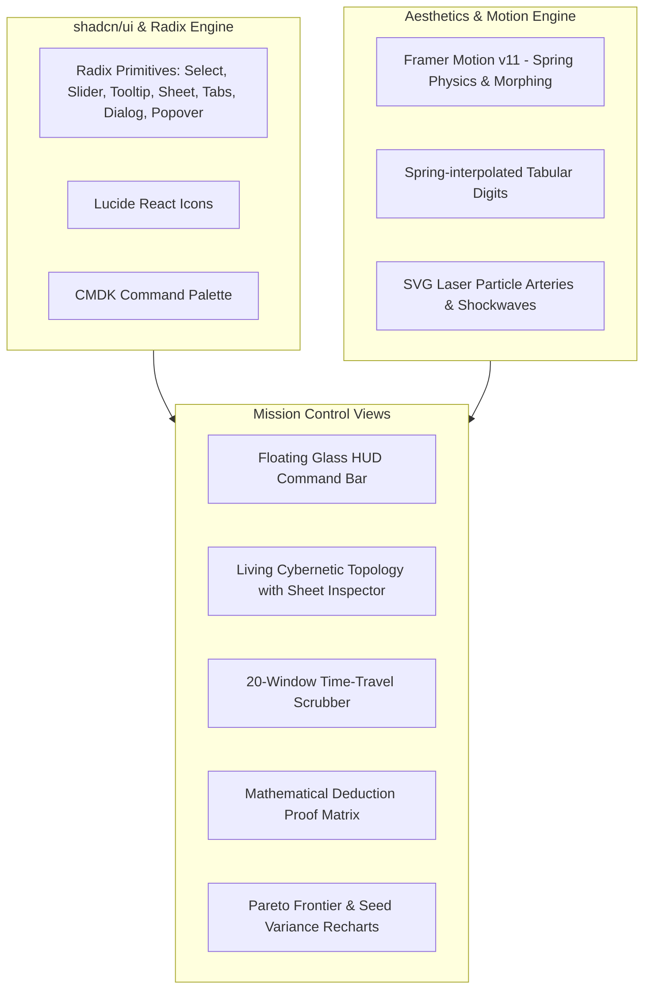

# ARIA — Implementation Plan & Tasks Roadmap

> **Target Workspace:** `C:\Mridul\Programs\ARIADNE\web`  
> **Specification Reference:** [`spec.md`](file:///C:/Mridul/Programs/ARIADNE/spec.md)  
> **Status:** All Phases Implemented & Verified  

---

## Architecture & Dependency Mapping

---

## Phase 1: Dependency Setup & Baseline Branching
- [x] **Task 1.1: Git Branch Preparation**
  - Verify working tree state.
  - Create feature branch `feat/elevated-mission-control-ui` to isolate all visual and component enhancements.
- [x] **Task 1.2: Install Core UI & Icon Dependencies**
  - Workspace: `web/`
  - Install headless Radix primitives:
    - `@radix-ui/react-select`
    - `@radix-ui/react-slider`
    - `@radix-ui/react-tooltip`
    - `@radix-ui/react-dialog`
    - `@radix-ui/react-tabs`
    - `@radix-ui/react-dropdown-menu`
    - `@radix-ui/react-accordion`
    - `@radix-ui/react-popover`
    - `@radix-ui/react-separator`
    - `@radix-ui/react-slot`
  - Install `lucide-react` for clean 1.25px stroke iconography.
  - Install `cmdk` for the spotlight command launcher.
- [x] **Task 1.3: Verify Package Resolution & Types**
  - Run `npm run build` in `web/` to ensure zero compilation regressions before modifying code.

---

## Phase 2: Design Token & Aesthetic Substrate
- [x] **Task 2.1: Elevate `tailwind.config.js` with OLED & Metallic Palettes**
  - Add deep obsidian background steps (`#030305`, `#07070A`, `#0C0D12`, `#13151C`).
  - Add hardware glass borders (`rgba(255,255,255,0.06)`, `rgba(255,255,255,0.12)`, `rgba(255,255,255,0.3)`).
  - Add semantic status glows:
    - Healthy: `#10B981`, glow `rgba(16, 185, 129, 0.25)`
    - Degraded: `#F59E0B`, glow `rgba(245, 158, 11, 0.25)`
    - Down/Breached: `#EF4444`, glow `rgba(239, 68, 68, 0.35)`
    - Cyber Cyan: `#06B6D4`, glow `rgba(6, 182, 212, 0.25)`
- [x] **Task 2.2: Refine `globals.css` with Hardware Doppelrand & Glow Utilities**
  - Implement `.doppelrand-card` (outer micro-ring container + inner light-catching core).
  - Implement `.glow-healthy`, `.glow-degraded`, `.glow-down`, `.glow-cyan`.
  - Add scanline / subtle military grid patterns and radial vignette utility classes.
  - Configure hardware-accelerated transitions and custom slim scrollbar styles.

---

## Phase 3: shadcn/ui Component Primitives Library
Build modular, strictly typed components inside `web/src/components/ui/`:
- [x] **Task 3.1: Button, Badge & Separator (`button.tsx`, `badge.tsx`, `separator.tsx`)**
  - Implement variant-based buttons (default, glass, outline, ghost, destructive, glow).
  - Implement metallic badges with status dot indicators.
- [x] **Task 3.2: Select, Slider & Tooltip (`select.tsx`, `slider.tsx`, `tooltip.tsx`)**
  - Accessible, glassmorphic dropdowns with smooth animation.
  - Precision tactile slider with illuminated track and custom thumbs for risk appetite ($\tau$).
  - High-density tooltips with micro-delays for mathematical annotations.
- [x] **Task 3.3: Sheet Drawer & Dialog (`sheet.tsx`, `dialog.tsx`)**
  - Slide-over inspection drawer (`Sheet`) for deep node analytics.
  - Modal dialog with blurred backdrop for scenario exports and graph inspector.
- [x] **Task 3.4: Tabs & Accordion (`tabs.tsx`, `accordion.tsx`)**
  - Pill-style sliding indicator tabs using Framer Motion `layoutId`.
  - Nested diagnostic drill-down accordions for audit logs and test evidence.
- [x] **Task 3.5: Command Palette Engine (`command.tsx`)**
  - Spotlight modal overlay with keyboard shortcuts (`Cmd+K`).

---

## Phase 4: Floating Glass HUD & Tactical Command Controls
- [x] **Task 4.1: Floating Command HUD (`CommandHUD.tsx`)**
  - Design floating pill dock positioned top-center over topology and incident pages.
  - Integrate Scenario Selector (`<Select>`), Seed Picker (1–20), and System Mode Switcher.
- [x] **Task 4.2: Tactile Risk-Appetite Dial (`RiskAppetiteDial.tsx`)**
  - Connect slider $\tau \in [0.0, 1.0]$ to global Zustand store.
  - Visual trigger indicator: show real-time threshold comparison against current incident confidence.
- [x] **Task 4.3: Transport Playback Controller (`PlaybackControls.tsx`)**
  - Play, pause, step forward/back, and speed multipliers (1x, 2x, 5x) with smooth Framer Motion interactions.

---

## Phase 5: Living Cybernetic Topology Engine
- [x] **Task 5.1: Custom Hardware Chip Nodes (`HardwareChipNode.tsx`)**
  - Render Merchant, Methods (UPI, Card, Netbanking), PSPs, and Banks with metallic double-bezel framing.
  - Add micro-LED status indicators and dynamic health delta readouts.
- [x] **Task 5.2: Pulsating Distress Shockwaves (`DistressPulse.tsx`)**
  - Implement expanding concentric ripple rings when node success rate drops below threshold.
- [x] **Task 5.3: Laser Particle Arteries & Reroute Surge Edges (`ParticleEdge.tsx`)**
  - SVG animated light particles traveling along cubic bezier curves.
  - Particle velocity and density dynamically bound to transaction volume.
  - Reroute surge: when traffic shifts from a failing PSP to a healthy sibling, stream visibly accelerates with an emerald burst.
- [x] **Task 5.4: Slide-Over Node Deep-Dive Drawer (`NodeInspectorSheet.tsx`)**
  - Integrate with topology canvas node click events.
  - Render window-by-window performance sparklines, error code distributions, and counterfactual mitigation estimates.

---

## Phase 6: Precision Telemetry & Deduction Matrix
- [x] **Task 6.1: Rolling Odometer Ticker (`OdometerTicker.tsx`)**
  - Build vertical rolling digit component using Framer Motion spring mass physics.
  - Apply to Recovered Revenue, Expected Revenue, and Success Rate metrics.
- [x] **Task 6.2: Interactive Mathematical Proof Tree (`ProofMatrix.tsx`)**
  - Render interactive formula card: $S = \text{Coverage} \times \text{Specificity} \longrightarrow \mathbf{\text{Confidence}}$.
  - Animated SVG circular confidence arc gauge with gradient glow.
  - Interactive terms with hover tooltips explaining eliminated hypotheses.
- [x] **Task 6.3: Interactive 20-Window Time-Travel Scrubber (`TimeTravelScrubber.tsx`)**
  - Mini histogram sparkline of transaction volume & success rate across all 20 windows.
  - Crimson highlight zone for injected incident duration; emerald halo zone for recovery window.
  - Draggable magnetic thumb with instant canvas synchronization.

---

## Phase 7: Mission-Control Navigation, Command Palette & Route Polish
- [x] **Task 7.1: Global Command Palette (`Cmd + K`)**
  - Keyboard listener for quick scenario jumping (`Cmd+1` to `Cmd+5`), seed switching, topology imports, and audit viewing.
- [x] **Task 7.2: Shell & Sidebar Upgrade (`AppShell.tsx`)**
  - Double-bezel sidebar with live system telemetry status indicator (FastAPI connection health, active scenario badge).
  - Clean Lucide icons for all routes.
- [x] **Task 7.3: View Refinements**
  - `CommandCenterPage.tsx`: Hero layout featuring Live Incident Experience, Proof Tree, and Recovery Console.
  - `TopologyPage.tsx`: Full-bleed cybernetic graph with floating HUD and Time-Travel Scrubber.
  - `EvaluationPage.tsx`: Upgraded Pareto Frontier & Seed Variance panels with dark-glass Recharts tooltips and glow accents.
  - `AuditPage.tsx`: High-density test execution audit trail with collapsible log accordions.
  - `ConnectPage.tsx`: Elegant topology JSON importer with drop-zone and live graph preview.

---

## Phase 8: End-to-End Verification & Performance Benchmarking
- [x] **Task 8.1: Full TypeScript & Build Validation**
  - Execute `npm run build` in `web/` ensuring 0 type errors or bundle issues (Passed in 10.21s).
- [x] **Task 8.2: Python Engine Integrity Check**
  - Run full test suite: `pytest -q` to confirm all 74 unit/simulation tests remain 100% green (74/74 passed in 90.85s).
- [x] **Task 8.3: Visual & Interactive Inspection**
  - Verified scenario switching, time scrubbing, risk dial adjusting, node drawer sliding, and command palette navigation.
